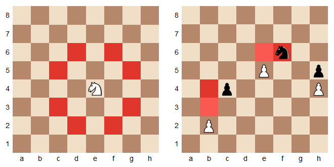
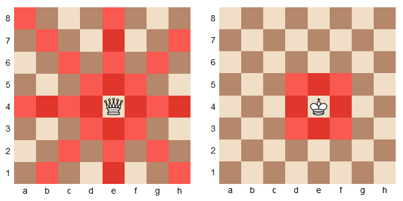
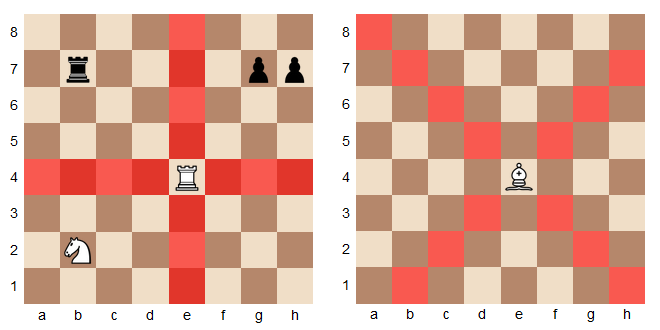

# Titre du projet
    Chess of Duty
# Slogan
    Tactical Queen incoming!!
# liste des étudiants
    Samy Van Calster
    Théo Vienne
    Julien Bouin
    Florian Delbe
    Théo Lenglart

# But du jeu 
    Utiliser ses pions afin de piéger le roi adverse et de le mettre en echec et mat. 

    Chaque joueur joue à tour de rôle pour effectuer un seul coup. Les joueurs ne peuvent pas choisir de sauter un tour de jeu  ils doivent déplacer une pièce. Chaque pièce d'échecs se déplace d'une manière spécifique, et doit être déplacée selon son  mouvement légal.
    Les cases rouges représentent les mouvement possibles de chaque piéce.

