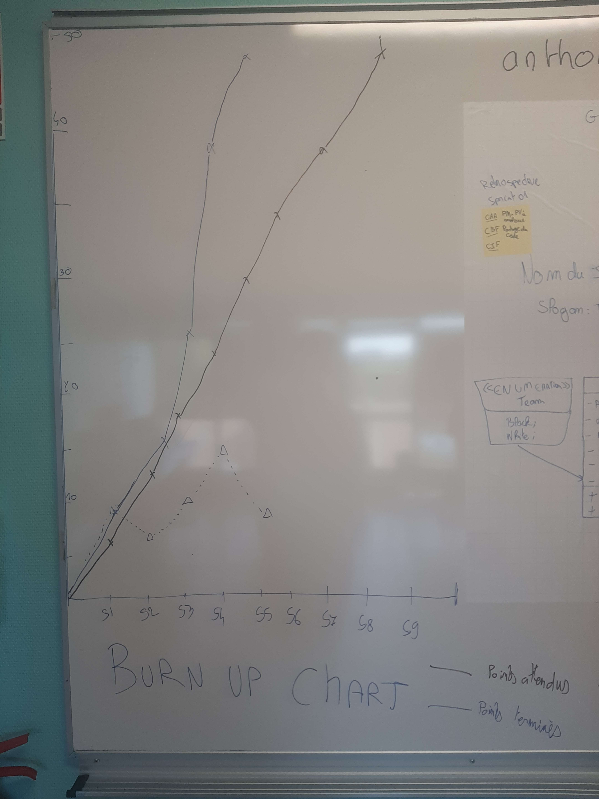

# Sprint n°06
## Démonstration
    - Tentative de faire fonctionner une démo du jeu : les pions n'avancent pas
    - Démonstration du diagramme UML actuel
## Rétrospective
### Fait pendant le sprint
    - Diagramme UML des nos classes actuelles
    - Finition de l'assemblage du jeu
### Point fort
    - Travail toujours réparti correctement.
### Sur quoi avons nous butté
    - Nous avons eu des erreurs dans les déplacement de nos pions car nous n'avions pas assez fait de tests unitaires. 
### Que faire au prochain sprint
    Terminer le jeu
    Ajouter le systéme de sort et d'attaque au jeu

