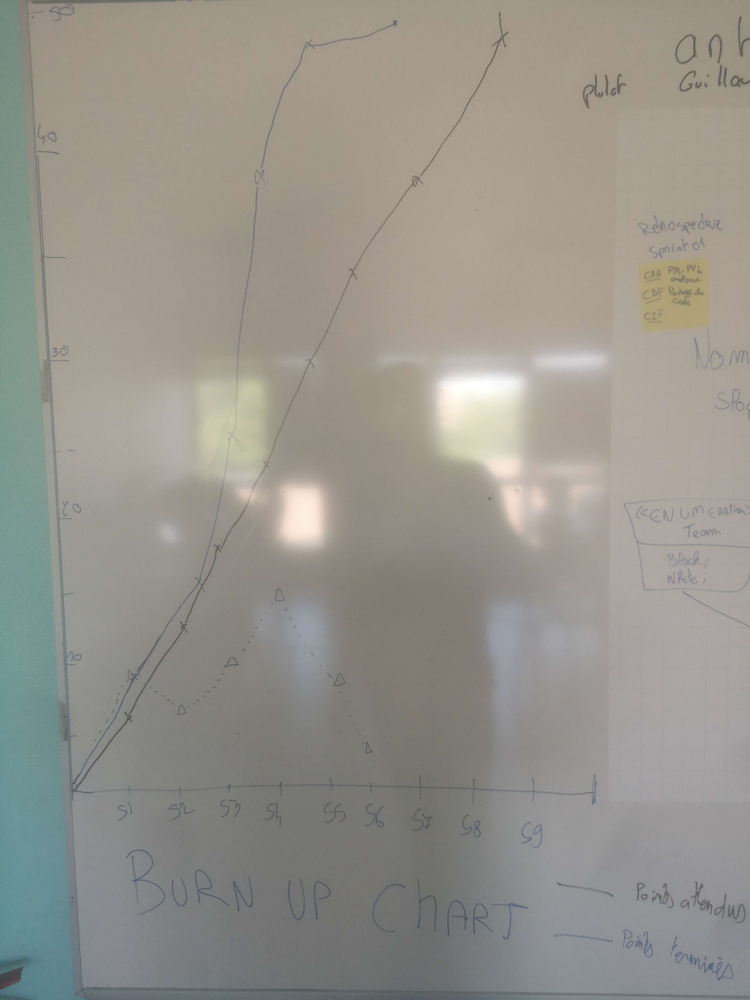
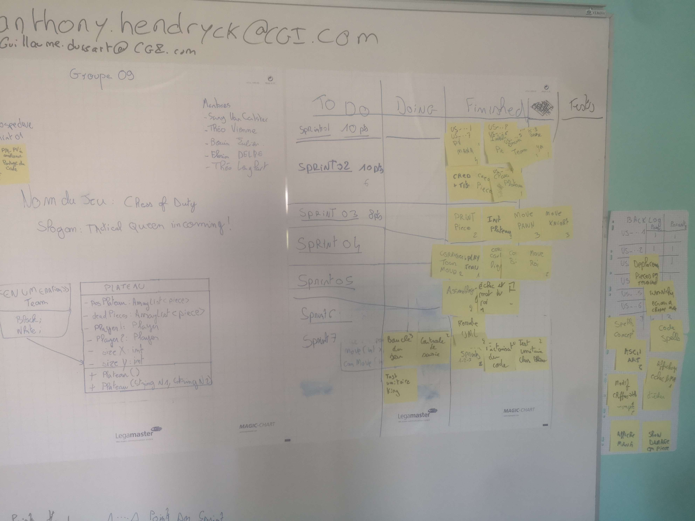

# Sprint n°07
## Démonstration
    - Présentation du fonctionnement du jeu
    - Correction d'un bug visuel sur le plateau
## Rétrospective
### Fait pendant le sprint
    - Finition du jeu afin de le lancer
    - Finition du mode de commande permettant au joueur de jouer une piece
    - créations de test unitaires pour valider le jeu
### Point fort
    - 
### Sur quoi avons nous butté
    - Nous avons eu un soucis avec les entrées utilisateur à cause d'un scanner. Et nous manquons de temps pour ajouter le systéme de sort et d'attaque.
## PDCA : 
    Nous faisons le choix de passer les prochains sprint sur l'optimisation et le gestion des erreurs afin d'avoir un jeu certes moins complet que la promesse de début mais assurément fonctionnel. 

