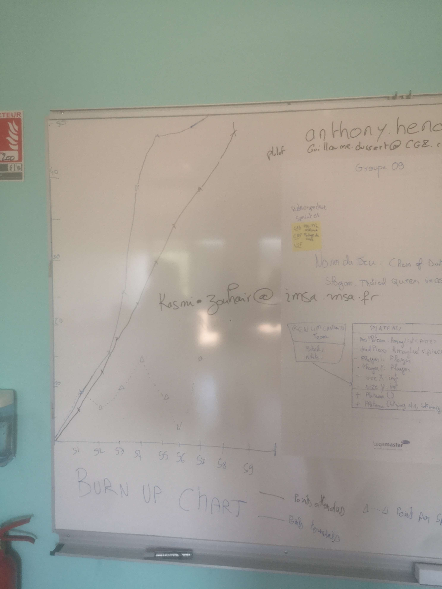

# Sprint n°08
## Démonstration
    - Présentation du jeu avec ajout de l'echec et mat
## Rétrospective
### Fait pendant le sprint
    - Modification du readMe et des sprints
    - ajouts des class de test
    - amélioration de l'algorithme d'échec et mat
### Point fort
    - 
### Sur quoi avons nous butté
    - Pendant la démonstration, nous nous sommes rendu compte que le jeu met un echec et mat dans certains cas non attendu. Nous avons également eu des soucis avec git.
## PDCA : 
    Nous passerons le prochain et dernier sprint à améliorer le readMe ainsi qu'à réparer les erreurs du jeu. 

