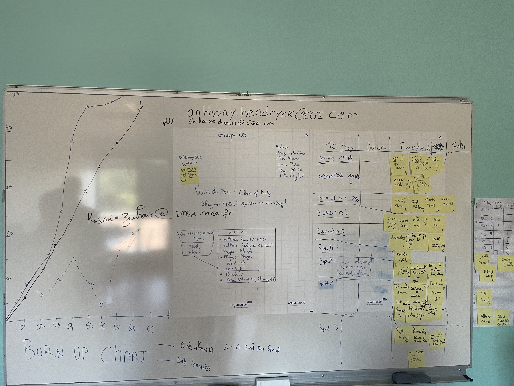

# Sprint n°09
## Démonstration
    - Présentation du jeu final avec un screen clear
## Rétrospective
### Fait pendant le sprint
    - Ajouter les derniers ajouts sur le readMe
    - ajouts du dernier Sprint sur le git
    - modification de l'event d'echec et mat afin qu'il ne s'active qu'a la mort du roi
### Point fort
    - Capacité d'adaptation
### Sur quoi avons nous butté
    - rien
## PDCA : 
    Nous planifions, avec plus de temps, de créer une démo du jeu qui se joue automatiquement en boucle. 

